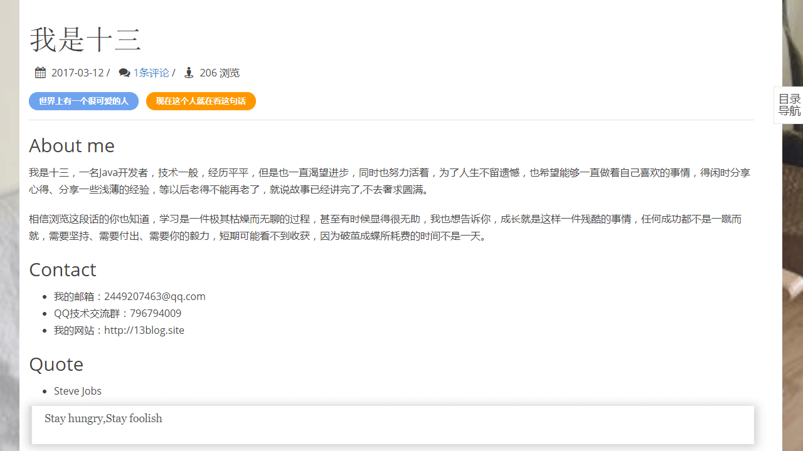
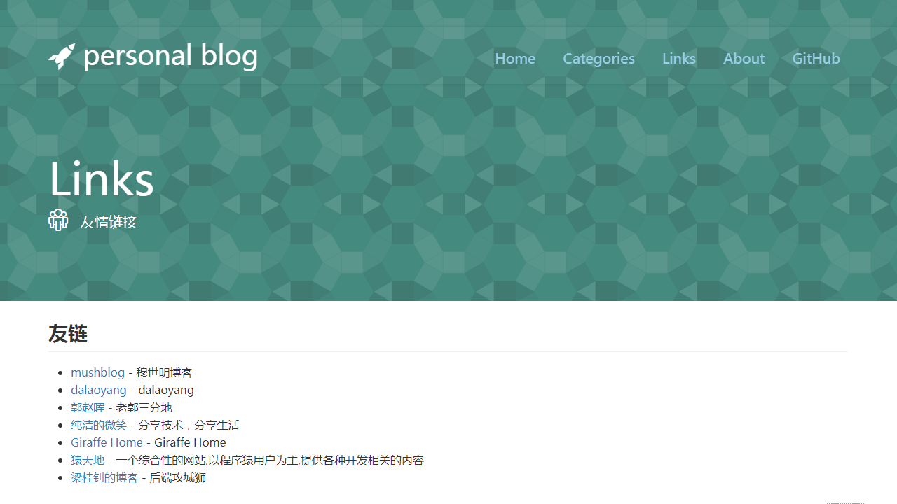

# 克隆自[My-Blog](https://github.com/ZHENFENG13/My-Blog)


## 注意事项

- **数据库文件目录为```static-files/my_blog_db.sql```；**
- **My Blog 后台管理系统的默认登陆账号为 admin 默认登陆密码为 123456；**


## 效果预览

### 后台管理页面

- 登录页

	

- 后台首页

	

- 文章管理

	

- 文章编辑

	

- 评论管理

	

- 系统配置

	

### 博客展示页面

开发时，在项目中**内置了三套博客主题模板，主题风格各有千秋**，效果如下：

#### 模板一

- 首页

	

- 文章浏览

	

- 友情链接

	

#### 模板二

- 首页

	

- 文章浏览

	

- 友情链接

	

#### 模板三

- 首页

  

- 文章浏览

  

- 友情链接

  
